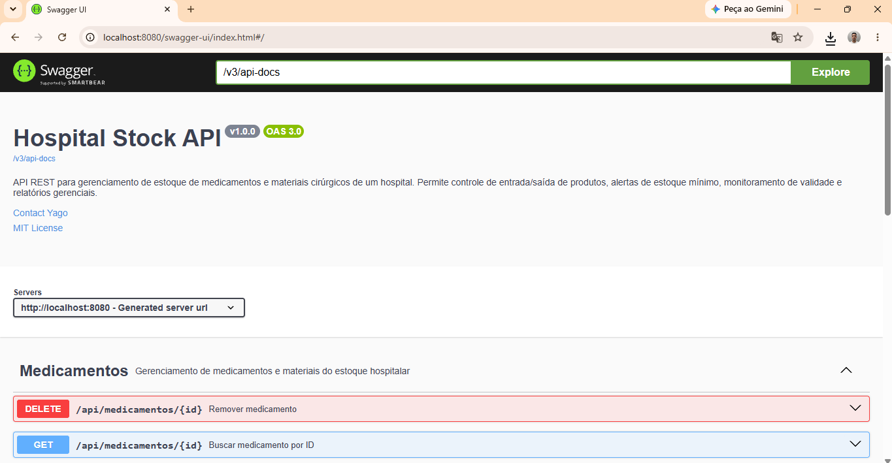

<h1 align="center">Olá, eu sou o Yago Machado Siqueira 👋</h1>

  

  💻 Desenvolvedor Backend em formação &nbsp;•&nbsp;
  🎓 ADS - Universidade Anhembi Morumbi &nbsp;•&nbsp;
  📍 São Paulo, Brasil

  🚀 Em busca da minha primeira oportunidade como Desenvolvedor Backend (Estágio/Júnior)

  
  
  

---

## 👨‍💻 Sobre mim

Sou estudante de ADS apaixonado por tecnologia e desenvolvimento Backend. Atualmente estou focado em aprofundar meus conhecimentos em **Java, Spring Boot, bancos de dados e APIs REST**, desenvolvendo projetos para fortalecer meu portfólio e aplicar boas práticas de programação (Clean Code, SOLID, testes automatizados).

Além da graduação, busco aprender continuamente por meio de cursos, projetos práticos e desafios que me preparem para atuar profissionalmente como desenvolvedor.

---

## 🚀 Stack e ferramentas

  

---

## 📌 Projeto em destaque

### 🏥 Hospital Stock API

API REST desenvolvida em **Java + Spring Boot** para gerenciamento de estoque de medicamentos e materiais cirúrgicos de um hospital. Permite controle de entrada/saída de produtos, alertas de estoque mínimo, monitoramento de validade e relatórios gerenciais.

  

**Principais funcionalidades**
- CRUD completo de medicamentos e materiais hospitalares
- Alertas automáticos de estoque mínimo e itens vencidos/próximos do vencimento
- Relatórios gerenciais (totais por categoria, unidades em estoque, itens críticos)
- Documentação interativa da API via Swagger/OpenAPI
- Cobertura de testes unitários com JUnit e Mockito

**Tecnologias utilizadas**

  
  
  
  
  
  
  

**Arquitetura:** aplicação organizada em camadas (`controller`, `service`, `repository`, `dto`, `entity`, `exception`, `config`), seguindo boas práticas de Clean Code e princípios SOLID.

🔗 [Ver repositório](https://github.com/yagosiqueira-dev/hospital-stock-api)

---

## 📚 Atualmente estudando

- ☕ Java
- 🌱 Spring Boot
- 🔗 APIs REST
- 🗄️ MySQL
- 🐳 Docker
- 🌿 Git e GitHub
- 🧪 Testes com JUnit e Mockito
- 🧱 Programação Orientada a Objetos
- 📖 SQL

---

## 🎯 Objetivos para 2026

- ✔️ Conseguir minha primeira oportunidade como Desenvolvedor Backend
- ✔️ Aprimorar conhecimentos em Spring Boot
- ✔️ Desenvolver projetos completos utilizando Java
- ✔️ Aprender testes automatizados (JUnit)
- ✔️ Estudar arquitetura de software e microsserviços
- ✔️ Evoluir constantemente como desenvolvedor

---

## 📊 GitHub Stats

  
  

---

## 🤝 Vamos nos conectar

  
  

⭐ Obrigado por visitar meu perfil! Fique à vontade para explorar meus projetos e acompanhar minha evolução como desenvolvedor.

